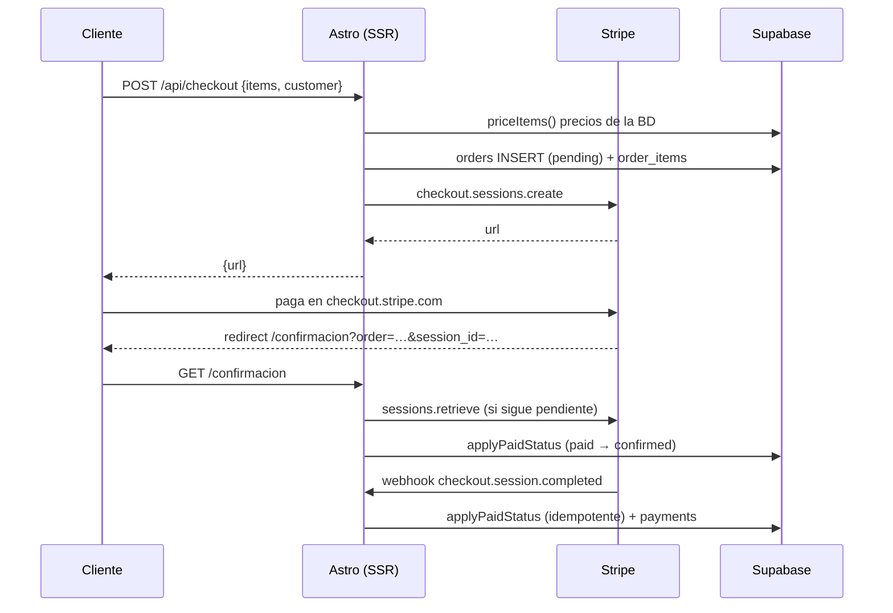

# Pago con Stripe (Checkout alojado)

La tarjeta **nunca** pasa por la tienda: el formulario del checkout recoge solo
datos de contacto/envío y el cobro se captura en el dominio de Stripe (PCI SAQ A).

## Flujo


```mermaid
sequenceDiagram
    participant C as Cliente
    participant A as Astro (SSR)
    participant S as Stripe
    participant D as Supabase

    C->>A: POST /api/checkout {items, customer}
    A->>D: priceItems() precios de la BD
    A->>D: orders INSERT (pending) + order_items
    A->>S: checkout.sessions.create
    S-->>A: url
    A-->>C: {url}
    C->>S: paga en checkout.stripe.com
    S-->>C: redirect /confirmacion?order=…&session_id=…
    C->>A: GET /confirmacion
    A->>S: sessions.retrieve (si sigue pendiente)
    A->>D: applyPaidStatus (paid → confirmed)
    S->>A: webhook checkout.session.completed
    A->>D: applyPaidStatus (idempotente) + payments
```

## Endpoints

| Ruta | Qué hace |
|---|---|
| `POST /api/checkout` | Valida carrito, crea pedido en `pending` y devuelve la URL de Stripe. |
| `POST /api/webhooks/stripe` | Valida la firma `Stripe-Signature` y aplica el pago. |

Eventos a suscribir en Stripe → Developers → Webhooks:

- `checkout.session.completed`
- `checkout.session.async_payment_succeeded`
- `checkout.session.async_payment_failed`
- `checkout.session.expired`
- `payment_intent.payment_failed`
- `charge.refunded`

URL local de pruebas:

```
stripe listen --forward-to localhost:4321/api/webhooks/stripe
```

## Variables de entorno

Stripe tiene **dos ranuras** (test y live) y un interruptor. Así se puede
guardar la llave de producción sin borrar la de pruebas:

| Variable | Tipo | Para qué |
|---|---|---|
| `PUBLIC_STRIPE_ENV` | público (build) | `live` o `test`. Elige la ranura. |
| `STRIPE_SECRET_KEY_LIVE` | secreto (runtime) | `sk_live_…` |
| `STRIPE_SECRET_KEY_TEST` | secreto (runtime) | `sk_test_…` |
| `PUBLIC_STRIPE_PUBLISHABLE_KEY_LIVE` | público (build) | `pk_live_…` |
| `PUBLIC_STRIPE_PUBLISHABLE_KEY_TEST` | público (build) | `pk_test_…` |
| `STRIPE_WEBHOOK_SECRET_LIVE` | secreto (runtime) | firma del endpoint live |
| `STRIPE_WEBHOOK_SECRET_TEST` | secreto (runtime) | firma del endpoint de pruebas |

Respaldo: si una ranura no existe, se usa la variable genérica
(`STRIPE_SECRET_KEY`, `PUBLIC_STRIPE_PUBLISHABLE_KEY`, `STRIPE_WEBHOOK_SECRET`).
Si `PUBLIC_STRIPE_ENV` no está, el entorno se deduce del prefijo de la llave.

El switch lo resuelve `lib/stripe.ts` (`stripeEnv`, `stripeSecretKey`,
`stripePublishableKey`, `stripeWebhookSecret`). `stripeMode()` sigue leyendo el
prefijo real de la llave: es la fuente de verdad de lo que se está cobrando.

### Pasar a producción

1. Stripe → Developers → API keys → **Reveal live key** → `sk_live_…` y `pk_live_…`.
2. Stripe → Developers → Webhooks → **Add endpoint** con la URL
   `https://www.dinerosobreproblemas.com/api/webhooks/stripe`, los mismos
   eventos que el de pruebas, y copia su `whsec_…`.
3. Vercel → Settings → Environment Variables (scope **Production**):
   `STRIPE_SECRET_KEY_LIVE`, `PUBLIC_STRIPE_PUBLISHABLE_KEY_LIVE`,
   `STRIPE_WEBHOOK_SECRET_LIVE` y `PUBLIC_STRIPE_ENV=live`.
4. **Redeploy** (las `PUBLIC_*` se graban en el build).
5. Probar una compra real de bajo importe y verificar en Stripe → Payments que
   el cargo aparezca en modo **live**.

Volver a pruebas: `PUBLIC_STRIPE_ENV=test` y redeploy. No hay que borrar nada.

## SQL

Correr una vez en Supabase → SQL Editor:

```
scripts/stripe_checkout.sql
```

Agrega `orders.payment_reference` y el índice por `provider_transaction_id`.

## Modo prueba

Con `sk_test_…` no se mueve dinero. Las tarjetas de prueba son números válidos
(Luhn + BIN real) pero la autorización la simula Stripe:

- `4242 4242 4242 4242` → aprobada
- `4000 0000 0000 0002` → rechazada
- `4000 0027 6000 3184` → exige 3D Secure

También sirve una tarjeta real: no se cobra.

Para volver a pruebas basta `PUBLIC_STRIPE_ENV=test` y redeploy (ver arriba);
las variables `_TEST` o las genéricas siguen ahí.
